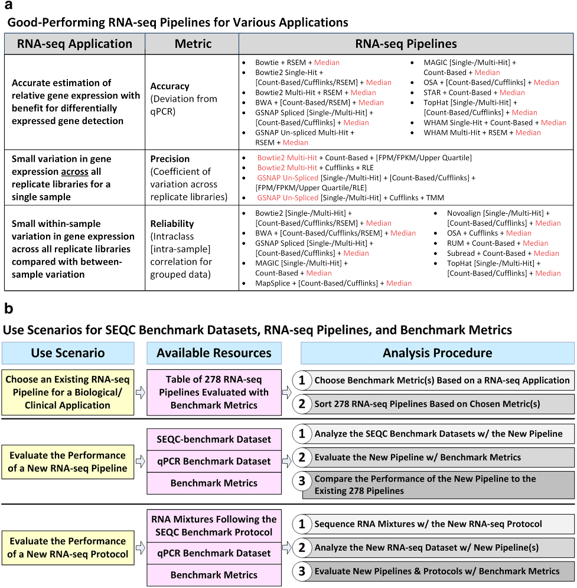
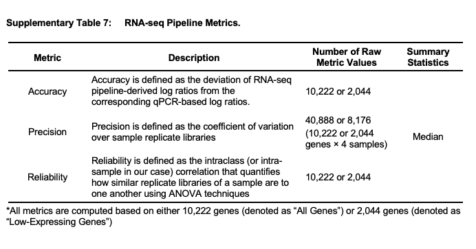
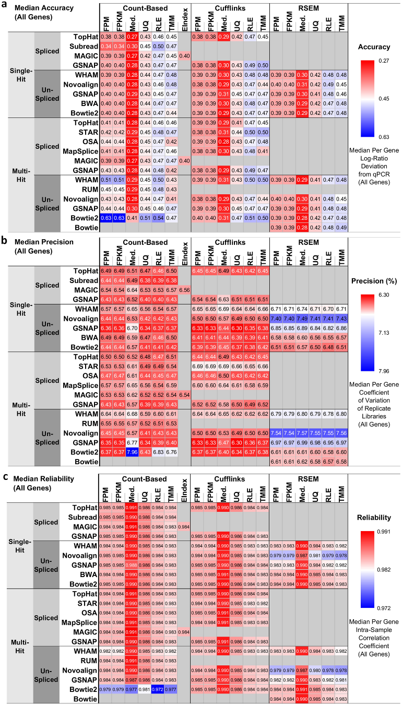
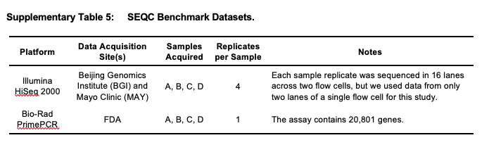
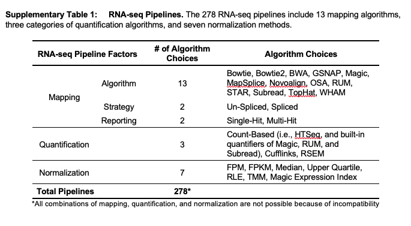
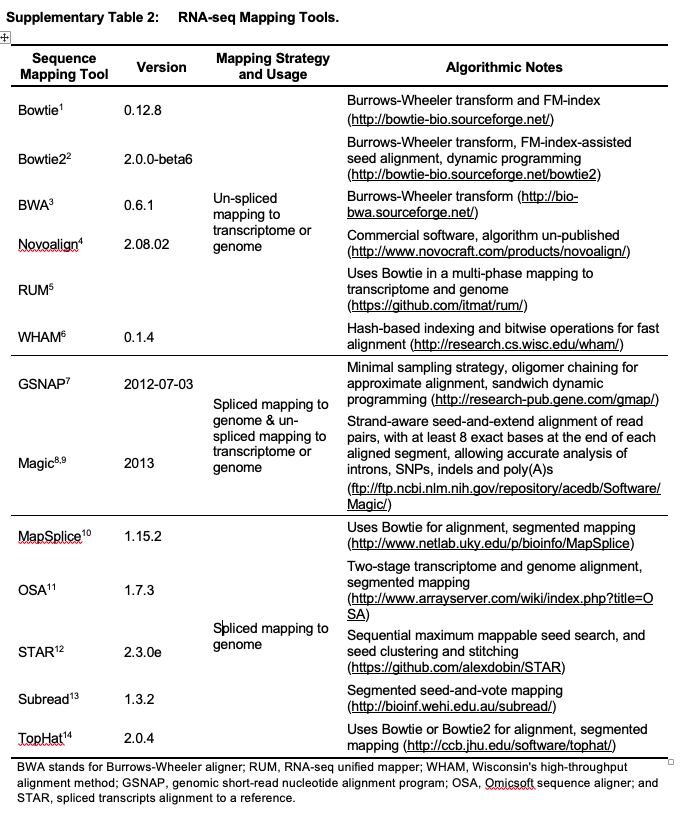
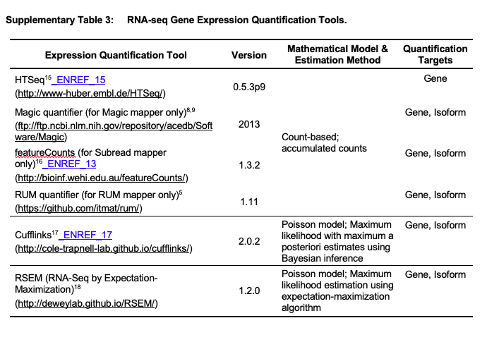

# RNA-seq FDA benchmark paper {#rna-fda}

**Title** _[Impact of RNA-seq data analysis algorithms on gene expression estimation and downstream prediction](https://www.nature.com/articles/s41598-020-74567-y#MOESM2)_ 

 

* Accuracy - as the deviation of RNA-seq pipeline-derived log ratios of gene expression from the corresponding qPCR-based log ratios. A smaller deviation represents higher accuracy. Median normalization exhibited the lowest deviation, or the highest accuracy, compared with all other normalization methods.

* Precision - as the coefficient of variation (CoV) of gene expression across replicate libraries. Smaller CoV represents higher precision. pipelines with any of Bowtie2 multi-hit, GSNAP un-spliced, or Subread mapping and either count-based or Cufflinks quantification, except for the [Bowtie2 multi-hit + count-based + med.] pipeline, were the best choice for quantifying genes with high precision, or low CoV.

* Reliability - as the intra-class (i.e., intra-sample in the context of the SEQC-benchmark dataset) correlation (ICC) of gene expression. Larger ICC represents higher reliability. median normalization along with most mapping and quantification algorithms, except for the [Bowtie2 multi-hit + count-based] and [Novoalign + RSEM] pipelines, was the best choice for quantifying genes with high reliability, or high ICC.

* The resulting heatmaps in accrodance to pipeline metrics strategy

**_Benchmarking datasets_**

**_The tools used in pipelines_**

**_Mapping tools used in pipelines_**

**_Quantification tools used in pipelines_**

