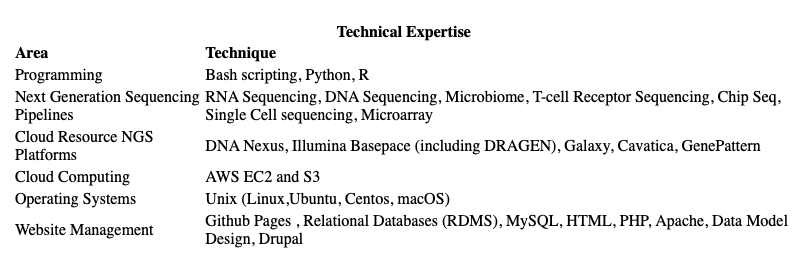
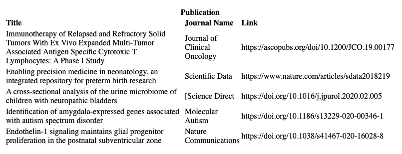
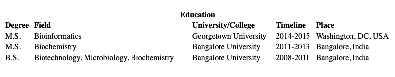

--- 
title: "Memoirs of a bioinformatician"
author: "Payal Banerjee"
# date: "`r Sys.Date()`"
site: bookdown::bookdown_site
documentclass: book
bibliography: [book.bib, packages.bib]
biblio-style: apalike
link-citations: yes
description: "This is an journaling blog for my work and reading related to bioinformatics."
---

# About me 

**[Orchid ID](https://orcid.org/0000-0003-1599-0679)**

  
